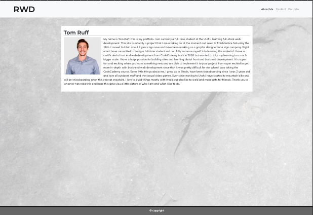
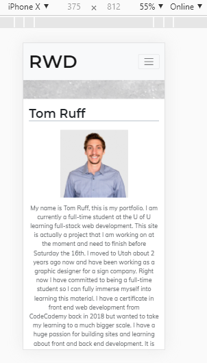
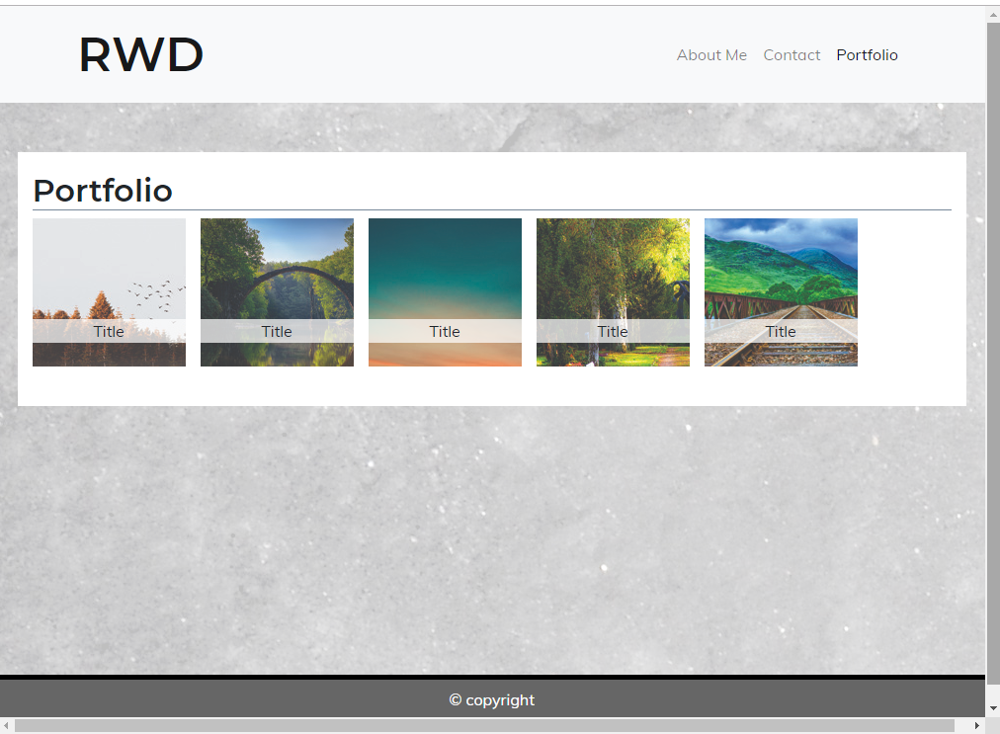
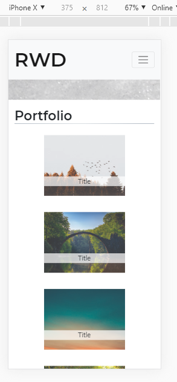

My Bootstrap Portfolio site. 
Im not a huge fan of bootstrap so this was a stuggle for me. I guess I like having controll over the styles when im creating the site. This actually took me longer than the first project haha anyway, This site is mobile friendly.

This image shows it standard size and then as an iphone X

 

For the portfolio page

 

I can say that I am pleased with how the nav is super easy expecially for mobile.
Anyway hope this is a good readme for this project I'm sure I'll learn better practices down the road for these.

